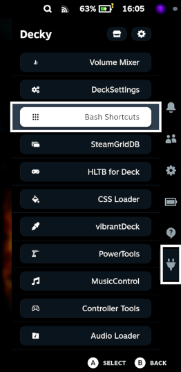
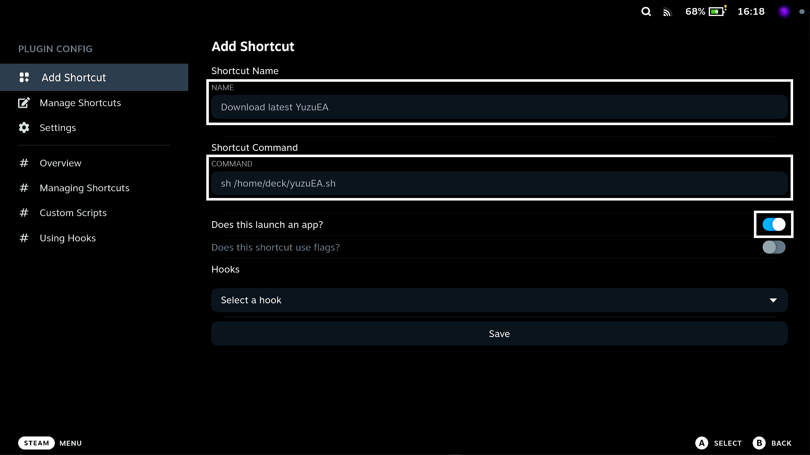
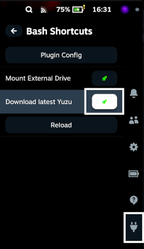

# What is yuzuEAupdater?
YuzuEAupdater is a very simple script targeted at **Steam Deck usage** that simply downloads and replaces previous build of Yuzu (either Mainline or EA build) by the latest release of YuzuEA downloaded from ***[pineappleEA](https://github.com/pineappleEA/pineapple-src)***.

For this script to work You will need preferably Yuzu installed through ***[EmuDeck](https://github.com/dragoonDorise/EmuDeck)*** project or manualy installed Yuzu in **AppImage format AND ONLY IN APPIMAGE FORMAT**. **This does not work with any flatpack version**.

# Usage 
You can use this script standalone in desktop mode of Your steam deck, but I highly recomend adding it in **Bash Shortcuts** plugin from ***[Decky Loader](https://github.com/SteamDeckHomebrew/decky-loader)*** official plugin store.

## Guide for adding YuzuEA.sh to Gaming mode on Deck
1. Firstly download and safe ***[yuzuEA.sh](yuzuEA.sh)*** to Your preferable location. In my case I'm saving it directly into ***/home/deck/***.

2. Download ***[Decky Loader](https://github.com/SteamDeckHomebrew/decky-loader)*** and then install ***Bash Shortcuts***.

3. After You installed ***Bash Shortcuts*** You should be able to see it under plugin section of your quick settings menu on Your deck. Like this:

4. Next We will add script to Your newly installed plugin. Open ***Bash Shortcuts*** and select ***Plugin Config***.

5. Fill in all information and **REMEMBER TO CHECK *"Does this launch an app?"*!!** Example configuration:

6. Click on ***Save*** and You are ready to go.

## Starting script

To start the script head over to Your plugins as shown before, open up ***Bash Shortcuts*** and You will see the script. Hit the rocket button and after a while You should see window with question about downloading latest release of YuzuEA from ***pineappleEA***.

